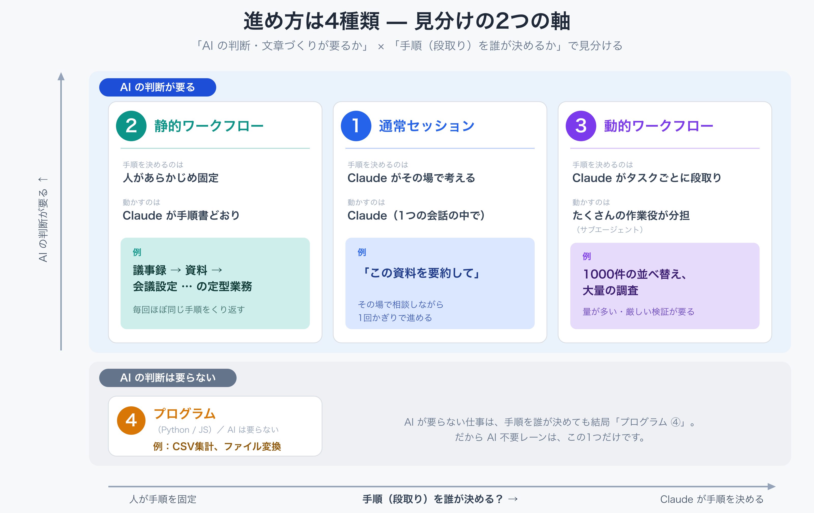
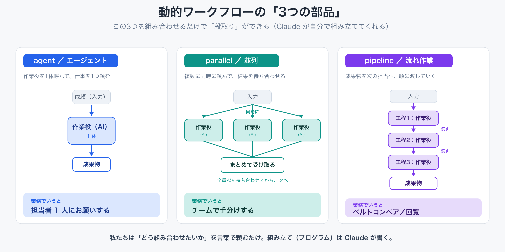

# Claude Code 中級者研修（2回目） 業務を仕組み化する ｜ QA3（O さん）自動化させる

> ゴール：「議事録 → 提案資料 → 会議候補日 → 会議案内メール下書き → リマインド」までの一連の流れを、**Claude Code に任せて自動で回す**ところまで体験する。

## QA3（O さん）の悩み

> **質問**：今はほとんどの業務を Claude のチャット上で処理していて、都度やり取りするので**同じ作業を毎回ゼロから指示**している。打ち合わせ後の流れ（議事録 → 資料作成 → 会議設定 → スケジュール設定 → 先方への送付メール下書き → リマインド…）を、**毎回チャットで指示するのではなく、一連の流れとして自動で回したい**。


### この座学の前提

| 項目 | 内容 |
|---|---|
| 受講者 | 第 1 回・第 2 回の前半（セットアップ／記憶／スキル入門）まで終えた方 |
| 環境 | Mac（macOS）／会社の Google Workspace |
| 形式 | 前半は座学（スライド説明）、後半はハンズオン |
| 時間 | 約 125 分（座学 40 分＋ハンズオン 75 分＋ふりかえり 10 分） |

> 専門用語には必ず日本語の補足を添えます。分からない言葉が出てきたら、巻末の「付録：用語ミニ辞典」を見てください。

> **この座学のゴール**：自分の定型業務について「①どういう進め方（通常／静的WF／動的WF）が合うか」を自分で見分けられて、②判定ツールで答え合わせし、③そのままワークフローを組み始められる状態になる。

### 全体スケジュール

| パート | 時間の目安 | 内容 |
|---|---|---|
| Part 1 | 約 20 分 | 座学①：スキルとワークフローは「別の軸」 |
| Part 2 | 約 20 分 | 座学②：静的ワークフローと動的ワークフローの違い |
| Part 3 | 約 25 分 | ハンズオン：判定ツール（プラグイン）で自分の業務を診断 |
| Part 4 | 約 50 分 | ハンズオン：判定結果からワークフローを組み上げる |
| Part 5 | 約 10 分 | ふりかえり・宿題 |

---

# Part 1　座学①：スキルとワークフローは「別の軸」（約 20 分）

> **ゴール**：「スキル」「静的ワークフロー」「動的ワークフロー」「プログラム」がごちゃ混ぜにならないよう、**2つの軸に分けて**整理できるようになる。

## 1-1. つまずきの正体 — 横一列に並べると混乱する

最初に正直に言うと、多くの人が次のように**全部を横一列に並べて**「どれを選べばいい？」と考えてしまい、混乱します。

```
   スキル ？ 静的ワークフロー ？ 動的ワークフロー ？ プログラム ？
   └────────── ぜんぶ同じ列で比べようとして迷子になる ──────────┘
```

実はこれ、**性質のちがう2つのものを同じ列に混ぜている**のが原因です。分けると一気にスッキリします。

## 1-2. 2つの軸に分ける — 「進め方」と「箱」

整理のコツは、次の**2つの軸**に分けることです。

| 軸 | 問い | 選択肢 |
|---|---|---|
| **軸A：進め方** | その仕事を「どう動かすか」 | 通常セッション／静的ワークフロー／動的ワークフロー／プログラム |
| **軸B：パッケージング** | できたものを「どう保存して使い回すか」 | **スキル（Skill）＝箱** |

ここがいちばん大事なポイントです。

> **スキルは、ワークフローと“並ぶもの”ではありません。スキルは「箱」です。**
> 軸A（進め方）で選んだものを、あとで再利用できるように**箱に詰めたもの**がスキルです。

たとえると——

| もの | たとえ |
|---|---|
| ワークフロー（進め方） | 料理の**作り方・段取り** |
| スキル（箱） | その作り方を書いた**レシピカード**（次回も同じ手順を再現できる） |

だから正しい言い方は「**静的ワークフローを“スキルとして”保存する**」「**動的ワークフローを“スキルに”同梱する**」です。「スキル vs ワークフロー」と比べた時点で、軸を取りちがえています。

```
  軸A：進め方を1つ選ぶ      軸B：使い回したいなら箱に入れる
  ┌─────────────────┐        ┌──────────────┐
  │ 通常 / 静的WF /  │  ──→   │  スキル（箱）  │
  │ 動的WF / プログラム│        │  にして保存    │
  └─────────────────┘        └──────────────┘
```

## 1-3. 進め方は4種類 — 見分けの軸は「AIが要るか・手順を誰が決めるか」

軸A（進め方）には4種類あります。見分ける決め手は、たった1つ。
**「各ステップにAIの判断・文章づくりが要るか／手順（順番）を誰が決めるか」** です。



| 進め方 | 各ステップでAIが要る？ | 手順を決めるのは | だれが動かす | 例 |
|---|---|---|---|---|
| **① 通常セッション** | 要る | Claude がその場で考える | Claude（1つの会話の中で） | 「この資料を要約して」 |
| **② 静的ワークフロー** | 要る | **人があらかじめ固定** | Claude が手順書どおりに進める | 議事録→資料→会議設定…の定型業務 |
| **③ 動的ワークフロー** | 要る | **Claude がタスクごとに段取りを組む** | たくさんの作業役（サブエージェント）が分担 | 1000件の並べ替え、大量の調査 |
| **④ プログラム（Python/JS）** | **要らない（決まった計算）** | 人がコードで固定 | パソコンが計算する | CSV集計、ファイル変換 |

境目の見分け方：

- **① と ②**：手順を毎回その場で考えさせる（①）か、いつも同じなので固定して繰り返す（②）か。
- **② と ③**：手順の「形」が毎回同じなら②。**形そのものをタスクに合わせて変える必要がある**なら③（→ Part 2 でくわしく）。
- **②③ と ④**：ステップに**AIの判断が要る**なら②③。全部が**決まりきった計算**（同じ入力なら必ず同じ答え）なら、そもそもAIは不要で、ただの**プログラム④**で十分です。

> **コツ**：「AIに考えさせる必要がある？」→「毎回同じ手順？」の2つを自問するだけで、だいたい①〜④のどれかに振り分けられます。

## 1-4. 「JS（プログラム）が2種類ある」という混乱をほどく

もう1つ、よくある混乱が「**動的ワークフローもJS、ふつうのプログラムもJSなら、同じでは？**」というものです。これは**別物**です。決定的な違いは、**ゼロから全部作るのか／用意された部品を組み合わせるだけなのか**にあります。

- **ふつうのプログラム（④）**：計算や処理を**ゼロから全部書く**。素材（木材）から削り出して家具を作るイメージ。
- **動的ワークフロー（③）**：「作業役（AI）を動かすための**部品**」が**あらかじめ数個用意**されていて、Claude はそれを**組み合わせる**だけ。ブロック（積み木）の**組み立てキット**で形を作るイメージ。

**動的ワークフローの“中心になる3つの部品”**（これらを並べ替えるだけで段取りができます）

| 部品 | 何をするもの | 業務のたとえ |
|---|---|---|
| **agent（エージェント）** | 作業役（AI）を1体呼んで、仕事を1つ頼む | 担当者 1 人にお願いする |
| **parallel（並列）** | 複数の作業役に**同時に**頼んで、結果を待ち合わせる | チームで**手分け**する |
| **pipeline（流れ作業）** | 成果物を次の担当へ**順に渡して**いく | **ベルトコンベア**／回覧 |

> ほかにも「終わるまで繰り返す」「結果を1本にまとめる」などの補助部品はありますが、**核はこの3つ**です。Part 2 で出てくるパターン（ファンアウト＆合成、トーナメント…）も、結局はこの部品の**組み合わせ方の“型”**にすぎません。



だから③のJSは「コード」というより「**用意された部品（agent / parallel / pipeline）で組み立てた、AIたちへの指示書**」、④のJSは「**ゼロから書いた、計算をする道具**」。同じJSでも、出発点（部品ありき／ゼロから）も目的もまったく違います。

| | 動的ワークフローのJS（③） | ふつうのJS／Python（④） |
|---|---|---|
| 作り方 | **用意された部品を組み合わせる** | **ゼロから全部書く** |
| 各処理の中身 | **AI（Claude）を呼び出して働かせる** | ただの計算（AIは出てこない） |
| たとえると | **積み木の組み立てキット**／指揮者の譜面 | **素材から削り出す**／電卓・道具 |

> **補足**：受講者のみなさんが③のJSを手書きする必要はありません。**動的ワークフローでは Claude がこの部品の組み合わせ（段取り）を自分で書いてくれます。** 私たちは「どんな段取りにしてほしいか」を言葉で伝えるだけです。

---

# Part 2　座学②：静的ワークフローと動的ワークフローの違い（約 20 分）

> **ゴール**：「静的」と「動的」の違いを自分の言葉で説明でき、自分の業務がどちらか（または両方の組み合わせか）を見分けられるようになる。

## 2-1. 静的＝毎回同じ手順、動的＝段取りが毎回変わる

- **静的ワークフロー**：手順・順番が**毎回ほぼ同じ**もの。第2回でやる「議事録→資料→会議設定→…」の連鎖スキルはこれです。レシピが固定されているイメージ。
- **動的ワークフロー**：**段取り（ハーネス）の形が、その時のタスクに合わせて変わる**もの。たとえば「何件あるか分からないので、終わるまで繰り返す」「作った成果物ごとにチェック役を1人ずつ付ける」など。Claude がその場で段取りを組み立てます。

> **用語**：**ハーネス**とは「Claude がその仕事をどう進めるかの“段取りの仕組み”」のことです。動的ワークフローは、この段取りをタスクごとに作り変えられるのが特長です。

大事な注意：

> **「手順が多い＝動的」ではありません。** 手順が10個あっても、毎回同じ順番なら**静的**です。動的の価値は「あなたの状況に合わせて段取りが変わること」にあります。

## 2-2. 動的ワークフローが防ぐ「3つの失敗」

なぜ動的ワークフローという仕組みがあるのでしょうか。それは、**1つの会話で複雑な作業を長々と続けると起きやすい「3つの失敗」**を、仕組みで防ぐためです。

| 失敗 | どんなことが起きる | 業務でのたとえ |
|---|---|---|
| **① 途中で力尽きる** | 全部終わる前に「やりました」と言ってしまう | チェック項目50個のうち20個で「対応済み」と報告される |
| **② 自分びいき** | 自分が作ったものを自分で甘く採点する | 自分の書いた提案書を自分でレビューして「問題なし」 |
| **③ 目標のずれ** | 会話が長くなるうちに最初の指示を忘れる | 「英語は使うな」と言ったのに、後半でうっかり英語が混ざる |

動的ワークフローは、**作業役（サブエージェント）を分けて、それぞれに小さな目標だけ持たせる**ことで、これらを根性ではなく**仕組みで**防ぎます。

## 2-3. 動的ワークフローの代表パターン（やさしい言い換え）

動的ワークフローには「よく使う型（パターン）」があります。難しい名前がついていますが、中身は身近な業務にたとえられます。

| パターン名 | ひとことで言うと | 業務のたとえ |
|---|---|---|
| **ファンアウト＆合成** | 手分けして並列でやり、最後に1つにまとめる | 100ページを10人で分担チェックし、報告を1本に統合 |
| **敵対的検証** | 作る人とは別の人が、あら探しする | 提案書を、書いた本人ではない別の人がレビュー |
| **生成＆フィルタ** | 案をたくさん出して、基準で絞る | 社名を30案出して、語感の悪いものを削って3案に |
| **トーナメント** | 2つずつ比べて勝ち抜き戦で1位を決める | デザイン案を2つずつ見比べて、最終的に1案を選ぶ |
| **完了までループ** | 終わる条件に達するまで繰り返す | バグがゼロになるまで探し続ける |
| **分類＆実行** | まず仕分けして、種類ごとに対応を変える | 問い合わせを内容で振り分け、難しいものだけ専門担当へ |

> **コツ**：「点数を付けて1000件を並べ替えて」より「2つずつ比べて」（＝トーナメント）の方が、AIは正確に判断できます。センスや優先順位を決める仕事ほど効きます。

## 2-4. 見分け方フローチャート

ここまでをまとめると、見分け方はこの3つの問いだけです。

```
  Q1. その処理に、AIの判断や文章づくりが要る？
       いいえ → ④ プログラム（Python/JS）で十分。AIワークフローは不要
       はい  ↓
  Q2. 毎回ほぼ同じ手順の繰り返し？
       いいえ（一回きり）       → ① 通常セッション
       はい  ↓
  Q3. 段取りの「形」がタスクごとに変わる／量がとても多い／厳しい検証が要る？
       いいえ（形は固定）       → ② 静的ワークフロー
       はい                    → ③ 動的ワークフロー

  そして「また使いたい」と思ったら → 選んだものを ▶ スキル（箱）にして保存
```

### QA3 の業務に当てはめると

会議後フロー（議事録→資料→会議設定→スケジュール→メール下書き→リマインド）を当てはめてみましょう。

- 全体は「毎回ほぼ同じ順番」→ **外側は ② 静的ワークフロー**（だから第2回は連鎖スキルで作る）。
- ただし `資料作成` だけは「複数案を出して比べたい（センスが問われる）」→ **そこだけ ③ 動的ワークフロー**にすると質が上がる。
- `メール送付` は外部に出る取り消せない操作 → **人の確認を必ず挟む**（自動で送らない）。

このように「**外側は静的、ある1ステップだけ動的**」という組み合わせを **ハイブリッド** と呼びます。これがQA3業務の“正解の形”です。

> **覚えておくこと**：1つの業務に1つの進め方を当てる必要はありません。**ステップごとに見分けて、混ぜてよい**のです。

---

# Part 3　ハンズオン：判定ツール（プラグイン）で診断する（約 25 分）

> **ゴール**：座学で学んだ見分け方を、判定ツール `workflow-judge`（プラグイン）に診断させて答え合わせする。

## 3-1. プラグインと marketplace の1分まとめ

- **スキル** … Claude に新しい「やり方」を教える1フォルダ（中身は `SKILL.md`）。
- **プラグイン** … スキルやコマンドを**まとめて配って、コマンド一発でインストール**できるようにしたもの。
- **marketplace（マーケットプレイス）** … プラグインの「配布元の住所録」。GitHub の置き場所を登録しておくと、そこから入れられる。

> **たとえると**：スキル＝アプリ、プラグイン＝アプリのインストーラ、marketplace＝アプリストア、のような関係です。

## 3-2. workflow-judge プラグインをインストールする

`workflow-judge` は、**「この業務はどの進め方が合うか」を判定して設計図まで出してくれる**スキルです。プラグインとして配布しています。

#### Step 1：配布元（marketplace）を登録する

```
/plugin marketplace add https://github.com/hayashidakoichi/claude-workflow-judge
```

#### Step 2：プラグインをインストールする

```
/plugin install workflow-judge
```

#### Step 3：読み込み直す

```
/reload-skills
```

> **期待される動き**：インストール後、スキル一覧に `workflow-judge` が表示されれば成功です。`/workflow-judge` と打って明示的に呼ぶこともできます。

## 3-3. 自分の業務を判定させてみる

**プロンプト例**：
```
次の業務を自動化したい。どんなワークフローが必要か判定して、設計図を出してください。
「打ち合わせ後の流れ（議事録 → 資料作成 → 会議設定 → スケジュール設定 →
先方への送付メール下書き → リマインド）を、毎回チャットで指示せず一連で回したい。」
```

#### 何が起きているか（解説）

`workflow-judge` は、座学で学んだのと同じ手順で診断します。出てくるのは次のような**ステップ別の判定表**と設計図です。

| ステップ | 判定 | 理由 |
|---|---|---|
| 議事録 | ②静的の一部 | 要約だけ・形は固定 |
| 資料作成 | ③動的サブワークフロー | 複数案を比べたい（センス） |
| 会議設定／スケジュール | ②静的の一部 | 手順が固定 |
| メール下書き | ②＋人の確認 | 外部送信は取り消せない |
| リマインド | ②静的の一部 | 予約するだけ |

→ 総合判定は **ハイブリッド（外側は静的、資料作成だけ動的）**。座学の結論と一致しているはずです。**自分の頭で出した見分けと、ツールの判定を見比べてください**。これが答え合わせになります。

> **コツ**：自分の実際の業務（経費精算、問い合わせ対応、レポート作成など）でも試してみましょう。「どこを動的にすると効くか」が見えてきます。

---

# Part 4　ハンズオン：判定結果からワークフローを組み上げる（約 50 分）

> **ゴール**：判定で出た「ハイブリッド」の設計図をもとに、実際に静的ワークフローのスキルを作り、1ステップだけ動的にする体験をする。このあと本編 Part 3 の「6ステップを通す」へつなげる。

## 4-1. 静的ワークフローのスキルを作る（途中で止まらない工夫つき）

会議後フローを題材に、`SKILL.md`（手順書）を作ります。ポイントは、座学②で見た「途中で力尽きる」失敗を防ぐ4つの工夫です。

- **完了の基準を決める** … 各ステップに「ここまでできたら完了」をはっきり書く（例：資料は「URLが取得できたら完了」）。あいまいな「やった」を許さない。
- **状態ファイルで途中から再開** … どのステップまで終わったかを小さなファイルに記録。中断しても続きから再開できる。
- **人の確認ゲート** … 外部に出る操作（メール送信・会議招待）の前で必ず止める。**メールは「下書き」まで**で、送信は人が手動で。
- **引数でパラメータ化** … 会議名・日時・宛先などを毎回の入力値にして、固定で書かない。これで「毎回ゼロから指示」がなくなる。

**プロンプト例**：
```
会議後フローの静的ワークフローを SKILL.md として作ってください。
- ステップ：議事録→資料作成→会議設定→スケジュール→メール下書き→リマインド
- 各ステップに「完了の基準」を書く
- どこまで終わったかを状態ファイルに記録し、中断したら続きから再開する
- メールは下書きまで（送信しない）。会議招待は配信前に確認する
- 会議名・日時・宛先は実行時に渡す値にする
成果物は workspace/ フォルダに作ってください。
```

> **補足**：`/goal「6ステップ全部の成果物が揃うまで完了とみなさない」` を併せて使うと、途中で「終わったことにする」のをさらに防げます。

## 4-2. 1ステップだけ動的にする — 「資料作成」で複数案を比べる

判定で「資料作成だけ動的」と出ました。ここを **生成＆フィルタ → トーナメント** で組みます。

**プロンプト例**：
```
資料作成のステップだけ、動的ワークフローにしてください。
議事録から「要点重視」「ストーリー重視」「数値根拠重視」の3つの構成案を並行で作り、
「相手に伝わるか／論点もれがないか／簡潔か」で比べて、最良の1案を選んでください。
5kトークンの範囲で。
```

#### 何が起きているか（解説）

- まず3つの切り口で**並行して案を作り**（＝ファンアウト）、
- 次に**2つずつ比べて最良を選ぶ**（＝トーナメント）。
- 「一番いい案を1つちょうだい」と頼むより、**たくさん出して比べてから選ぶ**ほうが質が上がります（座学2-3）。

## 4-3. 安全装置のまとめ

| 装置 | 役割 |
|---|---|
| `/goal` | 「全ステップ完了まで止めない」を宣言。中途半端な区切りでの離脱を防ぐ |
| トークン上限 | 「○kトークンで」と上限を書く。使いすぎ（想定の5〜10倍）を防ぐ |
| 人の確認ゲート | 外部送信・取り消せない操作の前で止める |

> **大事な区別**：確認ゲートで止まるのは**正しい停止**（あなたの承認待ち）です。座学②の「途中で力尽きる」失敗とは別物。承認すれば必ず続きに進みます。

## 4-4. ここから本編へ

ここまでで「判定 → 設計図 → 組み上げ」の流れを体験しました。
このまま本編 **[第 2 回 Part 3「6ステップを通す」](Claude_Code_中級者研修_ForMac.md)** に進み、実際の MCP（Gmail・カレンダー・Drive など）につないで一連を動かします。

---

# Part 5　ふりかえり・宿題（約 10 分）

## できるようになったこと

- スキルは「箱」、ワークフローは「進め方」という**2つの軸**で整理できる。
- 進め方の4種類（通常／静的WF／動的WF／プログラム）を見分けられる。
- 静的と動的の違い、動的が防ぐ3つの失敗、代表パターンを説明できる。
- 判定ツールで自分の業務を診断し、ハイブリッド構成を読み取れる。

## 宿題

> 自分の定型業務を1つ選び、`workflow-judge` で判定させてください。
> 「外側は静的か」「動的にすると効くステップはどれか」「外部送信で止めるべき箇所はどこか」を、判定結果と自分の考えで答え合わせして、次回持ち寄りましょう。

---

# 付録：用語ミニ辞典

| 用語 | やさしい説明 |
|---|---|
| **ハーネス** | Claude がその仕事を「どう進めるか」の段取りの仕組み。 |
| **エージェント（作業役）** | 1つの作業に集中する Claude。動的WFでは複数のエージェントが分担する。 |
| **サブエージェント** | 親の指示で動く子の作業役。それぞれ別の会話を持つので、混ざらない。 |
| **ファンアウト** | 仕事を手分けして並行で進めること。 |
| **バリア** | 「全部終わるまで待つ関門」。次に進む前に全結果を揃えたいときに置く。 |
| **パイプライン** | 流れ作業。各項目が待ち合わせをせず順に流れていく。安く速い。 |
| **トーナメント** | 2つずつ比べる勝ち抜き戦で最良を決めるやり方。 |
| **生成＆フィルタ** | 案をたくさん出してから、基準で絞り込むやり方。 |
| **quarantine（隔離）** | 信頼できない外部の文章を読む役には強い操作をさせず、安全を保つ工夫。 |
| **MCP** | Claude と外部サービス（Gmail・カレンダー等）をつなぐ「電源プラグの共通規格」。 |
| **スキル（Skill）** | やり方を保存して使い回せる「箱」（中身は `SKILL.md`）。 |
| **プラグイン** | スキルなどをまとめて配り、コマンド一発で入れられるようにしたもの。 |
