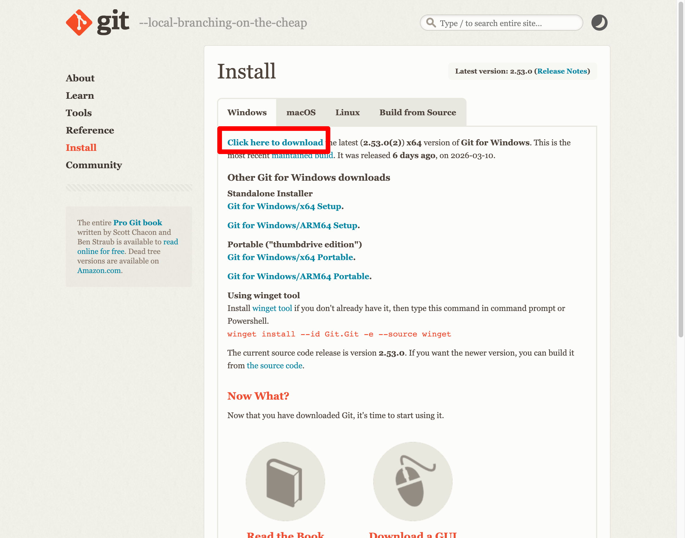

# Claude Code 実践トレーニング

## セクション 1：Windows 環境セットアップ（40 分）


*出典: [Microsoft — VS Code User Interface](https://code.visualstudio.com/docs/getstarted/userinterface)*

### 1-1. VS Code のインストール

1. https://code.visualstudio.com/ からインストーラをダウンロードして実行
2. インストール完了後、VS Code を起動する

### 1-2. VS Code の日本語化


*出典: [Microsoft — VS Code Display Language](https://code.visualstudio.com/docs/configure/locales)*

1. 左下の **歯車アイコン** → **Command Palette**（または `Ctrl+Shift+P`）
2. 「Configure Display Language」と入力して選択
3. 「日本語」を選択 → VS Code が再起動される

### 1-3. VS Code の基本画面

| 場所 | 名前 | 役割 |
|---|---|---|
| 左端のアイコン列 | アクティビティバー | エクスプローラー・検索・拡張機能などの切り替え |
| 左パネル | サイドバー | ファイル一覧や検索結果を表示 |
| 中央 | エディタ | ファイルの内容を表示・編集 |
| 下部 | ターミナル | コマンドを実行する場所（Claude Code もここで動く） |

> 配色を変えたい場合は、左下の「歯車アイコン」→「テーマ」→「配色のテーマ」から好みのテーマを選べる。

### 1-4. プロジェクトフォルダの準備

1. Windowsエクスプローラーで好きな場所にフォルダを作成（今回は、claude_traningという名前のフォルダ名にします）
2. VS Code のメニューから「ファイル」→「フォルダーを開く」で「claude_traning」を選んで「フォルダーを選択」して開くをクリック
3. VS Codeが開きます。
4. VS Code の左パネル（エクスプローラー）に `CLAUDE_TRAINING` と表示されれば成功

> **重要：Claude Code の操作範囲について**
>
> Claude Code は、VS Code で開いたフォルダ配下のすべてのファイルを自由に読み書きする。フォルダ内のファイルは Claude Code によって削除・追加・変更される可能性がある。逆に、開いたフォルダの外にあるファイルやフォルダには許可なくアクセスすることはない。そのため、**業務で使用する重要なファイルがあるフォルダを直接開かず、必ず専用のフォルダを作成して作業する**こと。

### 1-5. Git（Git Bash）のインストール

Claude Code は内部で Unix 系シェル（bash）を使う設計のため、Windows では **Git Bash** が必要になる。どのインストール方法を選ぶ場合でも、このステップは必須。


*赤枠の「Click here to download」をクリックしてインストーラをダウンロードする*

1. https://git-scm.com/download/win を開き、「**Click here to download**」をクリックしてインストーラをダウンロードして実行
2. インストーラの指示に従い、すべてデフォルト設定で進める
3. インストール完了後、以下の場所に `bash.exe` がインストールされていることを確認する

```
C:\Program Files\Git\bin\bash.exe
```

4. Windows の環境変数に `bash.exe` のパスを登録する

| 項目 | 値 |
|---|---|
| 環境変数名 | `CLAUDE_CODE_GIT_BASH_PATH` |
| 値 | `C:\Program Files\Git\bin\bash.exe` |

> **環境変数の設定方法**: Windows の「スタート」→「環境変数」で検索 →「システム環境変数の編集」→「環境変数」ボタン →「ユーザー環境変数」の「新規」から上記を追加する。

5. 設定後、VS Code のターミナルを **開き直す**（既に開いている場合は一度閉じてから再度開く）

### 1-6. Claude Code 本体のインストール（PowerShell ネイティブインストーラ）

Anthropic が現在推奨しているインストール方法は、PowerShell から公式の配布スクリプトを取得して実行する **ネイティブインストール** です。Node.js は不要で、コマンド 1 行でインストールが完了します。

**手順 1：PowerShell を起動する**

1. Windows の「スタート」を押して `powershell` と入力
2. 「Windows PowerShell」をクリックして起動（管理者権限は **不要**）
3. プロンプトの先頭が `PS C:\Users\<ユーザー名>>` のように `PS` で始まっていれば PowerShell です

> **PowerShell と CMD の見分け方**: 先頭に `PS` が付いていれば PowerShell、付いていなければ CMD（コマンドプロンプト）。本手順は PowerShell 用なので、`PS` が付いていることを必ず確認してください。

**手順 2：ネイティブインストーラを実行する**

PowerShell に以下を貼り付けて Enter：

```powershell
irm https://claude.ai/install.ps1 | iex
```

> **このコマンドは何をしているのか？**
> - `irm <URL>` … Invoke-RestMethod の略。指定 URL のスクリプトを取得する
> - `| iex` … Invoke-Expression の略。取得したスクリプトを PowerShell で実行する
> - 結果として、自分の Windows 用にビルドされた `claude.exe` が `%USERPROFILE%\.local\bin\claude.exe` に配置されます

> **`irm` is not recognized` と出たら**: PowerShell ではなく CMD を開いてしまっています。スタートからもう一度 `powershell` を検索して開き直してください。

**手順 3：インストール確認**

PowerShell を **一度閉じてから開き直し**、以下を実行します。

```powershell
claude --version
```

バージョン番号（例：`2.x.x`）が表示されれば成功です。

**ネイティブインストールのメリット**

- **Node.js / npm が不要** — Windows に開発環境を構築しなくてよい
- **自動更新** — 起動時にバックグラウンドで最新版に更新される
- **公式が現在もっとも推している方法** — トラブルが少ない

> **`claude` がコマンドとして認識されない場合**: PowerShell を一度閉じて開き直しても解決しないときは、`%USERPROFILE%\.local\bin` に PATH が通っていない可能性があります。`claude doctor` で診断、もしくは [付録 A](#付録-a別のインストール方法) のトラブルシューティングを参照してください。

### 1-7. VS Code 拡張機能のインストール（IDE 連携用）

ネイティブインストーラで `claude` コマンド本体は入りました。続いて、VS Code から Claude Code を操作するための **拡張機能** を入れます。これにより、ファイル変更が VS Code 上に即座に反映され、エディタで選択したコードを直接 Claude に渡せるようになります。


*出典: [Microsoft — VS Code Extension Marketplace](https://code.visualstudio.com/docs/configure/extensions/extension-marketplace)*

1. VS Code の左端アイコンから **拡張機能**（四角が4つのアイコン、または `Ctrl+Shift+X`）を開く
2. 検索欄に「Claude Code」と入力
3. 表示された「Claude Code for VS Code」をインストール
4. VS Code を **再起動**（×ボタンで閉じてから再度開く）

> 拡張機能は手順 1-6 でインストールした `claude.exe` 本体と連携して動作します。本体が入っていない状態で拡張機能だけ入れても動きません。

### 1-8. 初回ログインと起動


*出典: [Claude Code 公式ドキュメント — Use Claude Code in VS Code](https://code.claude.com/docs/en/vs-code)*

1. VS Code の右上のアイコンに追加された **Claude アイコン** をクリック
2. Claude Code パネルが開き、「Claude.ai Subscription」を選択する。初回はブラウザが起動する
3. Claude アカウント（会社の Google Workspace アカウント）でログイン
4. ブラウザでログイン完了後、「承認する」ボタンを押下すると、「Build something grate」というメッセージが現れて成功。
5. VS Code に戻ると利用開始されている
6. Claude Code に `/init` と入力して Enter：

```
/init
```

> `/init` を実行すると、Claude がプロジェクトの内容を分析し、設定ファイル（`CLAUDE.md`）を自動生成する。

> **ターミナル起動と VS Code 拡張機能、どちらを使うべき？**
>
> Claude Code には 2 つの使い方がある。
>
> | | ターミナル（PowerShell 等）で起動 | VS Code 拡張機能 |
> |---|---|---|
> | 起動方法 | `claude` コマンドを実行 | VS Code 内のパネルで操作 |
> | 向いている作業 | 単発の質問、ファイルのないテキスト生成 | ファイルの作成・編集を伴う作業全般 |
> | ファイル操作 | できるが、結果の確認にエクスプローラー等を別途開く必要がある | 作成・変更されたファイルが左パネルにすぐ表示され、プレビューも簡単 |
> | コードとの連動 | なし | エディタで選択中のコードを直接参照させられる |
>
> **本勉強会では VS Code 拡張機能を使用する。** ファイルの生成・編集が中心の作業では、変更内容をその場で確認できる VS Code の方が圧倒的に効率が良い。ターミナル単体での起動は、ちょっとした質問や、VS Code を開くまでもない軽い作業に向いている。


## セクション 2：はじめての操作（15 分）


*出典: [GitHub — anthropics/claude-code](https://github.com/anthropics/claude-code)*

VS Code の左端から **Claude アイコン** をクリックして Claude Code パネルを開き、以下の指示を入力する。

### 2-1. 競合を調べさせてみる

Claude Code に以下を入力する。AI がリアルタイムで Web サイトを読み込み、分析してくれる。

```
以下の3社のWebサイトを読んで、人事評価サービスの競合比較表を作ってください。
比較項目は「サービス概要」「主な機能」「ターゲット企業規模」「料金」とします。
markdownファイルとして保存してください。
- https://smarthr.jp/
- https://www.kaonavi.jp/
- https://hcm-jinjer.com/
```

> **markdown（マークダウン）ファイルとは？**
> テキストに簡単な記号を付けて見出しや箇条書きを表現する軽量な文書形式（拡張子 `.md`）。Word のように専用ソフトが不要で、メモ帳でも編集できる。Claude Code との相性が良く、AI が生成・修正しやすいため、本勉強会ではドキュメント作成の基本形式として使用する。

**許可を求められたら Yes を選択**

作成されたファイルが VS Code の左パネル（エクスプローラー）に表示されることを確認する。左パネルでファイルをクリックすると、中央のエディタに内容が表示される。

> **ポイント**: Claude Codeは、3 社の Web サイトをリアルタイムに読み取って比較表にまとめてくれる。手作業なら数時間かかる競合調査が、1 回の指示で完成する。

### 自動承認モードに切り替える


*出典: [Claude Code 公式ドキュメント — Use Claude Code in VS Code](https://code.claude.com/docs/en/vs-code)*

ここまでの操作で、Claude Code が何かを実行するたびに「Yes / No」の許可を求められることに気づいたはず。Web 検索やファイル作成のたびに毎回許可するのは手間がかかる。

Claude Code パネル下部の入力欄の横にあるモード切り替えから **「Edit automatically」** を選択すると、ファイルの作成・編集が自動承認される。

| モード | 動作 | 用途 |
|---|---|---|
| Ask before edit | すべての操作で許可を求める | 慎重に確認したいとき |
| **Edit automatically** | ファイル編集は自動承認、コマンド実行は許可を求める | **本勉強会ではこちらを推奨** |
| Plan mode | 実行前に計画を提示し、承認後に実行 | 大きなタスクで事前に内容を確認したいとき |

> 以降の演習は **Edit automatically** モードで進める。操作のたびに止まらないので、テンポよく作業できる。

### 2-2. 競合比較表を PDF にする


*出典: [Markdown PDF — VS Code Marketplace](https://marketplace.visualstudio.com/items?itemName=yzane.markdown-pdf)*

```
先ほど作った競合比較表の markdown ファイルを PDF に変換してください
```

### 2-3. PDF Viewer のインストール

VS Code で PDF を直接プレビューするために、拡張機能をインストールする。

1. VS Code の左端から **拡張機能**（`Ctrl+Shift+X`）or（歯車の絵から）を開く
2. 検索欄に「vscode-pdf」と入力
3. 表示された PDF Viewer をインストール
4. 左パネルのエクスプローラーから PDF ファイルをクリックすると、VS Code 内でプレビューできる

### 2-4. ドキュメント作成の基本フロー


*出典: [Microsoft — Markdown and Visual Studio Code](https://code.visualstudio.com/docs/languages/markdown)*

PDF や Word ファイルを直接編集するのではなく、**markdown ファイルを編集してから変換する**のが効率的なワークフロー。

1. markdown ファイルを作成（Claude Code に指示）
2. markdown から PDF・Docs・Excel などに変換（Claude Code に指示）
3. 変換後のファイルを確認しながら markdown ファイルを修正
4. 修正した markdown ファイルを再変換

> markdown ファイルのプレビューは、VS Code でファイルを開いた状態で `Ctrl+Shift+V` を押すと表示される。

---

続きは [実践トレーニング2.md](実践トレーニング2.md) で実施する。

---

## 付録 A：別のインストール方法

本編 1-6 では PowerShell からのネイティブインストールを案内したが、Anthropic は他にもいくつかの公式インストール方法を用意している。社内の方針や既存の環境に合わせて選んでほしい。

### A-1. CMD（コマンドプロンプト）からネイティブインストール

PowerShell ではなく CMD（コマンドプロンプト）を使いたい場合の方法。

1. Windows の「スタート」を押して `cmd` と入力 → 「コマンドプロンプト」を起動
2. プロンプトが `C:\Users\<ユーザー名>>` のように `PS` 無しで始まることを確認
3. 以下を貼り付けて Enter：

```batch
curl -fsSL https://claude.ai/install.cmd -o install.cmd && install.cmd && del install.cmd
```

> `The token '&&' is not a valid statement separator` というエラーが出たら、PowerShell を開いてしまっている。CMD を開き直すか、本編 1-6 の PowerShell 用コマンドを使う。

### A-2. winget でインストール

Windows 標準のパッケージマネージャ winget が使える環境であれば、以下 1 行で済む。

```powershell
winget install Anthropic.ClaudeCode
```

> **注意**: winget でインストールしたものは **自動更新されません**。最新版にしたいときは以下で手動更新します。
>
> ```powershell
> winget upgrade Anthropic.ClaudeCode
> ```

### A-3. npm（Node.js）でインストール

Node.js が既に入っていて、慣れた方法で入れたい場合の選択肢。Node.js 18 以降が必要。

**手順 1：Node.js のインストール**

1. https://nodejs.org/ から **LTS 版**（推奨版）のインストーラをダウンロードして実行
2. インストーラの指示に従い、すべてデフォルト設定で進める（npm も同時にインストールされる）
3. PowerShell を **開き直して** 以下のコマンドで確認する

```powershell
node -v
npm -v
```

両方ともバージョン番号が表示されれば成功。

**手順 2：Claude Code のインストール**

```powershell
npm install -g @anthropic-ai/claude-code
claude --version
```

> ⚠️ 管理者権限の昇格 PowerShell での実行は **避ける**。権限エラーが出たら、ユーザー権限のままで `npm config set prefix` を変更するか、本編 1-6 のネイティブインストーラに切り替えるほうが安全。

> **`node -v` でエラーが出る場合**: 「'node' は、内部コマンドまたは外部コマンド〜として認識されていません」と表示されたら、環境変数 Path が反映されていない。PowerShell を一度閉じて開き直し、それでもダメなら Windows をサインアウト → サインインで反映されることが多い。

### A-4. インストール状態の確認

どの方法でインストールしても、確認コマンドは共通。

```powershell
claude --version       # バージョン番号が出るか
claude doctor          # 詳細な診断
where.exe claude       # バイナリの場所（CMD では where claude）
```

### A-5. VS Code 拡張機能との関係

A-1〜A-3 のいずれでインストールしても、その上に VS Code 拡張機能を入れる手順は本編 1-7 と同じ。本体（CLI）と拡張機能はセットで使うイメージ。
